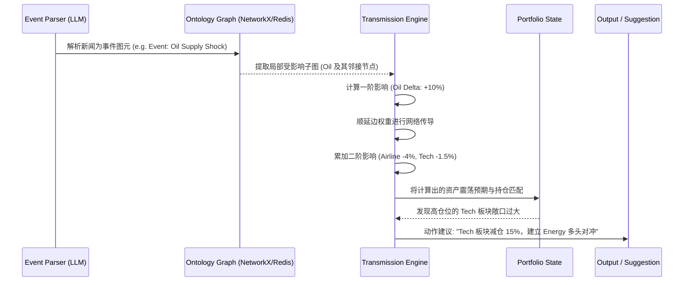

# 基于本体论的 IRM 模块核心设计方案

## 1. 设计哲学：从“线性统计”到“拓扑传导”

传统风控侧重于历史波动率（Volatility）和资产间的统计相关性（Correlation matrix）。但当黑天鹅事件发生时，历史相关性往往会失效。
**本体论风控 (Ontological Risk Management)** 的核心假设是：**市场是一个由因果和逻辑链条构成的复杂网络（语义图谱）**。风险并非随机爆发，而是沿着特定的“实体-关系”拓扑结构进行传导的。

---

## 2. 核心架构：三层架构模型

### 2.1 知识图谱层 (本体定义)
本体层定义了市场运行的“物理法则”与基本盘。
*   **节点 (Nodes - 实体与业务角色定义)**
    *   `InterestRate` (利率基准)：市场的“资本成本”锚点。决定了全球折现率的基础，是导致科技股和长久期资产杀估值的核心源头。
    *   `Currency` (货币与流动性)：市场的“购买力与风向标”。美元指数（DXY）反映全球美元流动性紧缩程度，日元等避险/套息货币则反映资本流向。
    *   `Volatility` (风险脉搏)：市场的“恐惧体温计”。VIX（股市）和 MOVE（债市）不直接产生价值，但决定了风险传递的放大倍数（Gamma效应）。
    *   `Commodity` (大宗商品)：实体经济的“成本项与避险端”。原油代表通胀压力，黄金代表对法币信用的对冲。
    *   `Sector` / `Theme` (行业与主题)：市场的“聚合层”。用于识别系统性行业风险或由特定叙事（如AI）引发的共振。
    *   `EquityETF` / `Stock` / `Crypto` (资产终端)：风险传导的“叶子节点”。这是所有计算最终落地的地方，也是计算损益和调整仓位的基本单位。
    *   `Hub` (基本面定价枢纽)：充当“宏微观翻译器” (Macro-to-Micro Translators)。
        *   `PE` (市盈率/估值倍数枢纽)：流动性与风险的天然接收器。负责吸收美国10年期国债收益率（贴现率）和 VIX（风险溢价）的变动，将其转化为资产估值倍数的收缩或扩张。
        *   `EPS` (每股收益/盈利预期枢纽)：实体经济与商业周期的传导接收器。吸收美元指数（汇兑利润）、大宗商品（成本）以及产业主题（海量订单）带来的冲击，转化为资产实际盈利基准的上调或下调。
    *   `Portfolio` (个人账户)：系统的“终局终端”。代表用户的资金分部、平均成本和当前持仓权重，是所有风控建议的目标。
    *   `Event` (扰动源)：传导链条的“第一推动力”。通常由微观或宏观突发新闻触发，通过 LLM 注入图谱引发波及。
*   **边 (Edges - 关系与业务传导含义)**
    *   `DRIVES` (宏观驱动)：描绘金融市场的“第一推动力”（如：油价驱动通胀预期，推高美债收益率信号）。
    *   `SPILLS_TO` (风险溢出)：描述由于市场脆弱性或恐慌导致的跨界传染（如：债市剧震引爆股市 VIX 飙升）。
    *   `PRICES` (定价压制)：宏观或风险因子对定价枢纽（PE/EPS）或具体标的的直接冲击测试路径（携带核心 `base_beta` 与修饰器 `state_trigger`）。
    *   `DETERMINES` (价值决定)：枢纽（Hubs）到底层资产的决定路径。基于基础定价公式 $P=EPS \times PE$，将枢纽的变动翻译为最终资产层面的价格浮动预期。
    *   `BELONGS_TO` / `HEAVILY_EXPOSED_TO` / `TRACKS` (结构归属)：定义资产在物理结构上（行业、指数成分）的静态暴露量。
    *   `DRIVES_THEME` / `PARTICIPATES_IN` (主题叙事)：超越传统行业划分的逻辑共振点（如：AI 主题叙事对相关软硬件的同步推升）。
    *   `CORRELATES_WITH` / `COMPOSES` (相关性补充)：统计学意义上的强联动补丁，用于捕捉无法用因果律直接解释但高度一致的市场行为。
    *   `HOLDS` (持仓触达)：系统决策的终端，将所有传导分值最终映射到用户账户持仓上，驱动凯利公式建议。

> [!tip] 图谱更新机制：静态结构与动态权重的分离
> 图的结构（Topology）不需要高频实时更新，但图的权重（Weights）和节点状态（State）需要阶段性或实时更新。
> - **结构层 (低频/静态)**：描述实体的物理属性与归属（如 Airlines 依赖 Oil），这是市场的“常识”层，结构非常稳定。
> - **状态与参数层 (中高频/动态)**：描述传导的敏感度和放大倍数。例如，“油价上涨打击航司利润”是静态结构，但当前油价是 40美元 还是 120美元（节点实时状态），决定了传导杀伤力的指数级差异。分析引擎在进行遍历推演前，只需拉取一遍最新的宏观水位数据即可完成“动态赋权（Dynamic Modifier）”，无需每秒重构整个高维网络。

### 2.2 推理计算层 (影响分析引擎)

当一个 **事件 (Event)** 发生时，引擎在图谱上进行穿透式的风险计算。

> [!important]
> 传导分析不只是看单个资产，而是看事件的涟漪效应如何渗透到整个投资组合。

#### 一阶影响 (First-Order Impact) - 直接/显性冲击
*   **机制**：事件直接作用于关联的首层节点。
*   **示例**：**中东冲突** $\xrightarrow{+ Impact}$ `Oil` (原油产出受限，价格上涨)。
*   **计算**：基于资产对该事件类型的历史贝塔 (Beta) 或专家规则进行 Delta 调整。

#### 二阶影响 (Second-Order Impact) - 延展/隐性联动
*   **机制**：首层节点的变动，沿着本体链条向次级节点传导。
*   **微观传导示例 (成本驱动)**：`Oil` 飙升 $\xrightarrow{- Impact}$ `Airline_Sector` (燃油成本骤增) $\xrightarrow{- Impact}$ `DAL` (达美航空估值受压)。
*   **宏观传导示例 (利率驱动)**：`Oil` 飙升 $\xrightarrow{+ Impact}$ `Inflation` (通胀反弹预期) $\xrightarrow{+ Impact}$ `US10Y_Yield` (美债收益率攀升) $\xrightarrow{- Impact}$ `Tech_Sector` (科技成长股杀估值)。
*   **计算**：使用图遍历算法（BFS/DFS），结合路径衰减因子（Decay Factor）计算二级、三级甚至四级网络节点的累积风险暴露。

#### 解构资产价格与戴维斯双杀诊断 (Davis Double Play/Kill)
*   **机制**：系统的定价公式基于 $P = EPS \times PE$ 构建。宏观与微观冲击不再是模糊地砸向底层股票，而是被 PE 和 EPS 两个独立枢纽进行精准吸收与翻译。
*   **诊断分析溯源**：
    *   **“杀估值”(纯流动性枯竭)**：当 US10Y 飙升，图算法清晰追溯到伤害全由 PE 枢纽承接，而代表基本面的 EPS 不变。此时定性为：资金面收紧，但公司依然赚钱。
    *   **“杀业绩”(基本面恶化)**：由于大宗飙升或汇率恶化引发的 EPS 枢纽下调，剥离了情绪面的干扰。
    *   **“戴维斯双杀”(共振必杀)**：当宏观上的利率飙升（压低 PE）与微观成本/业绩恶化（打压 EPS）同时发生定点共振，算力引擎将在节点得出非线性极高的负面冲击值，向交易员强降风险准备金与警告。

### 2.3 决策与执行层 (仓位管理输出)

分析引擎将图谱的波动映射至用户当前的 **Portfolio（持仓组合）**，并给出调仓反馈：

1.  **风险溯源聚类**：发现看似分散的仓位，实际上暴露在同一个底层节点上（例如组合持有 Tech 股和 Crypto，表面资产不同，但底层都极度依赖“充裕流动性/降息预期”节点）。
2.  **动态凯利公式仓位控制 (Dynamic Kelly Criterion Sizing)**：
    传统的凯利公式 $f^* = \frac{bp - q}{b}$ (其中 $p$ 为胜率, $q$ 为败率, $b$ 为盈亏比) 往往依赖历史静态假设。而在本体论 IRM 中，**图谱传导引擎输出的冲击分值 (Impact Score) 会被用来直接实时修正凯利公式的参数**：
    *   **胜率 ($p$) 惩罚**：如果一个资产（如 DAL）在事件传导中承受了极高的二阶负向冲击分值（如 -18），引擎会判定该资产的当前上涨概率大幅降低，强制下调其凯利公式中的预期胜率 $p$。
    *   **动态缩小仓位 ($f^*$)**：由于 $p$ 被下调，凯利公式计算出的建议仓位比例 $f^*$ 会呈指数级快速收缩。
    *   **结论输出**：系统不会简单地说“这票有风险”，而是通过凯利计算得出“由于油价传导恶化，该标的胜率降至40%以下，**建议将仓位从 15% 强制降至 0%（清仓）**”等极其精确的量化指令。
3.  **对冲路线推荐 (Hedging)**：在图谱中反向查询，寻找因该事件收益（正向二阶影响）且与当前持仓负相关的节点作为对冲资产。

### 2.4 长短期的凯利公式应用 (Time Horizon & Kelly Criterion)

长期投资者（如持仓以年为单位的价值投资者或大类资产配置者）是否适用凯利公式？答案是**适用，但参数输入和应用方式与短线交易有本质区别。** 

传统短线交易者的凯利公式输入源于“高频交易的历史统计（如过去100次突破策略的胜率）”。这是**经验概率（Frequentist Probability）**。
对于长期投资，这套 IRM 本体论系统将凯利公式的输入转化为了**贝叶斯概率（Bayesian Probability）**，其应用逻辑如下：

1.  **极值规避（防止毁灭性回撤）**
    长期投资最大的敌人不是日常波动，而是本金的永久性损失。本体论引擎计算出的二阶极值报警，正是为了在长期复利曲线上**剪除致命的左侧尾部风险**。当系统探测到结构性的宏观恶化（如行业颠覆、流动性枯竭），通过动态凯利公式强制减仓，可以避免长期资金深陷泥潭。

2.  **盈亏比 ($b$) 的重新定义**
    在长线投资中，$b$ 不再是“每次止盈止损设置的赔率”，而是**资产未来 3-5 年的预期收益率（CAGR）与最大回撤预期之比**。IRM 引擎通过评估企业在“本体图谱”中所处的生态位（例如：处于成长性赛道且对宏观加息敏感度低），赋予其更高的长期 $b$ 值，推高其基础配置比例。

3.  **部分凯利 (Fractional Kelly) 的必要性**
    满仓运行（Full Kelly）在数学上能在长期实现对数收益最大化，但在现实中会导致极其剧烈的波动。对于长期资金，IRM 系统在执行层应该引入“半凯利 (Half-Kelly)”或更低比例。**即：在本体论图谱给出确定性机会时，系统建议的仓位上限被限制在最优值的 50% 或更低。** 这保证了长期投资组合的夏普比率和账户的平稳生存。

### 2.5 资产先验假设 (Base Assumptions) 的业务定义

在长线投资（3-5 年）的语境下，系统为每个资产设定了一套“先天性格特征”，作为凯利公式的基础输入。

1.  **基础胜率 (base_win_rate / $p$)**：
    *   **业务含义**：代表对资产在投资周期内，基于其竞争壁垒和生态位持续复利能力的“初始确信度”。
    *   **分层策略**：指数类资产（如 QQQM）通常拥有最高的确信度（如 0.70）；高增长单股（如 NVDA, PLTR）因面临竞争和技术迭代，确信度居中；高波动投机资产（如 BTC）确信度最低。
2.  **预期盈亏比 (Upside vs Max Drawdown / $b$)**：
    *   **Upside**：资产在投资周期内预期的总回报潜能。
    *   **Max Drawdown (Max_DD)**：为获得上述回报必须承受的“人性门票”或极端风险底线。
    *   **$b$ 映射**：$b = Upside / Max\_DD$。它是系统判定该资产“值得承担多少回撤风险”的衡星标准。
3.  **动态惩罚逻辑**：
    *   分析引擎输出的 **Impact Score** 会直接扣减 **base_win_rate**。当本体传导显示某资产遭受严重冲击时，系统会判定其“复利确定性”下降，从而强制凯利公式输出更保守的仓位建议，甚至触发清仓（Liquidate）。

---

## 3. 传导公式与参数设计 (Transmission Formula & Engine)


在基于本体论的 IRM 系统中，一条边从 A 指向 B （$A \rightarrow B$），代表 A 的变动会冲击 B。
如何科学地定义这种冲击的**方向**、**强度**和**非线性放大机制**，是分析引擎的核心。

---

### 3.1 核心属性定义层 (Edge Parameters)

我们可以在图谱的每一条边上，定义三个核心属性：

#### 3.1.1 Base Beta (基准敏感度 $\beta$) (基准敏感度 $\beta$)
*   **物理意义**：历史常态下的线性传导系数。代表 A 每变动 1%，B 预期会如何变动。
*   **计算来源**：长期（如 1 年至 3 年）的 Pearson 相关系数或回归斜率。
*   **示例**：
    *   US10Y $\rightarrow$ Tech_Sector: $\beta = -1.5$ （美债收益率上升 1%，科技板块大概率下跌 1.5%）。
    *   Oil $\rightarrow$ Airlines: $\beta = -0.8$。
*   **作用**：决定传导的**基础方向（正相关/负相关）**和**基准力度**。

#### 3.1.2 State Modifier (状态修饰因子 $\mu$) 与机制转换 (Regime-Switching Engine)
*   **架构解耦原则（Node vs Edge）**：在系统设计中，**节点（Node）**仅包含客观的物理属性和当前状态值（如 PE 枢纽自带的 `percentile` 属性）；而**边（Edge）**承载传导计算规律。因此，所有的非线性修饰器（`state_trigger`）和引擎抓取准星（`modifier_metric`）均挂载在边上，由图遍历引擎主动感知并触发计算。
*   **物理意义**：基于目标节点 **当前水位（如历史分位 - percentile）** 的非线性放大器。它是对当前市场环境“极值状态”与“机制转换”的刻画。这在 PE（估值倍数）等本身具有分布特征的基本面指标上体现得尤为明显。
*   **设计原理**：当一个指标处于极低位置和处于极高位置时，它对边际利空的防御力是完全不对称的。“常态线性传导”与“泡沫黑天鹅传导”的差别就体现在这个阈值开关上。
*   **计算方式 (引擎侧)**：
    1.  图遍历引擎沿着边（如 `PRICES`）传递冲击时，读取边上的 `modifier_metric: 'target_percentile'` 指令。
    2.  根据指令，引擎主动去提取目标节点（如 PE 枢纽）当前的客观水位值（如 `percentile=0.99`）。
    3.  结合边上的 `state_trigger` 策略函数（例如 `percentile_amplifier` 或 `margin_dampener`），将分位数映射为一个非线性乘数。
*   **作用**：让线性拓扑网络获得捕捉 **Regime-Switching（状态切换）** 和感知**“安全边际”**的能力，同时完美保证了“数据层（客观状态）”与“逻辑层（传导效应）”的代码解耦。

##### 三大通用数学算子 (Universal Mathematical Operators)
为了确保计算引擎的可扩展性，避免硬编码具体的业务逻辑（如“AI泡沫”或“通胀危机”），图谱中的 `state_trigger` 被抽象为了以下 3 种纯数学算子，统一挂载在边上：

1.  **`percentile_amplifier` (极位指数放大器)**
    *   **数学含义**：当抓取到的底层目标节点处于**超高分位（> 85% 临界点）**时，乘数 $\mu$ 呈陡峭的指数级放大（如 1.5倍、3.0倍甚至更高）。
    *   **应用场景**：主要用于防范**“拥挤踩踏杀估值”**。例如应对 US10Y 冲击高估值的 NVDA/PLTR 时，或高油价引发通胀恐慌时。在极值区，即便是微小的边际利空，也会被视为压倒骆驼的最后一根稻草，引爆极高的非线性破坏力。
2.  **`margin_dampener` (安全边际与低位钝化器)**
    *   **数学含义**：当目标节点处于**极低分位（< 15%）**时，乘数急剧收缩（$\mu < 1$，例如 0.2 或 0.5）。
    *   **应用场景**：代表价值投资中的**“跌无可跌 (Price in)”**。只要大盘蓝筹资产（如 AAPL/GOOGL 的估值）跌到了历史极寒水位，它就会像海绵一样吸收并过滤上游传来的冲击，不再将恐慌等比传导至资产组合端，模拟“避险资金最后堡垒”的抗跌性。
3.  **`threshold_breaker` (阈值断路器 / 阶跃跃迁器)**
    *   **数学含义**：这是一种阶跃函数（Step Function）。正常状态下 $\mu = 0$ 或是极小的常态值，一旦源头节点突破某个**特定绝对阈值**，立刻触发 $\mu \ge 1.0$ 的暴力传导跨越。
    *   **应用场景**：不看历史百分位，只看**绝对阈值是否被切线突破**。例如，当实际利率（名义利率 - 通胀预期）跨越某个临界点时，资金将成群结队地无情抛弃黄金回流生息资产，此时直接触发价值重估机制。

#### 3.1.3 Volatility Accelerator (波动率加速器 / Gamma 因子 $\gamma$)
*   **物理意义**：市场恐慌情绪导致的流动性溢价与抛售踩踏效应。
*   **设计原理**：当整体市场处于高位震荡或“VIX（恐慌指数）”飙升时，坏消息的破坏力会被无情放大，好消息则会被无视。
*   **作用位置**：这是一个**全局参数（Global Setting）**或**宏观条件参数**。
*   **计算方式**：$\text{if } VIX > 30 \text{, then } \gamma = 2.0 \text{ else } \gamma = 1.0$。所有涉及避险或高风险资产下挫的边，乘以该系数。

---

### 3.2 距离衰减因子 (Distance Decay Factor, \(D^n\)) 的业务定义

在图谱遍历由于传递节点众多时，“蝴蝶效应”会被无限放大从而得出错误结论。为了让风险计算拟合现实（物理定律中的能量守恒），系统引入了距离衰减因子 $D^n$。

#### 物理与市场意义
*   **信息耗散**：随着传导链条的拉长，原始事件的影响力在金融市场中会被其它中间变量（如市场情绪的消化、公司的逆周期套期保值、套利者的抹平操作）所稀释。衰减因子代表了这种**影响力的沿途损耗**。
*   **确定性折价 (Uncertainty Discount)**：一阶影响往往是最确定的（比如突发加息 $\rightarrow$ 短期美债收益率飙升，这几乎是 100% 发生）。但传导到二阶、三阶时，逻辑链条变长，被证伪的概率增加。$D^n$ 本质上是对传导路径不确定性的一种“概率打折”。

#### 公式定义与赋值逻辑
*   **基础衰减常量 (D)**：通常取值为 `0.6` 到 `0.85` 之间。代表每经过一个节点跳转，原始冲击力保留的百分比。
*   **幂次递减 (n)**：$n$ 表示从源头事件节点（$n=0$）出发，经过的边的数量。
    *   源头事件 (Event) $\rightarrow$ 一级受影响资产 ($n=0$)，衰减为 $D^0 = 1$ (满额承受)。
    *   一级资产 $\rightarrow$ 二级资产 ($n=1$)，衰减为 $D^1$。
    *   二级资产 $\rightarrow$ 三级资产 ($n=2$)，衰减为 $D^2$。

**示例**：
假设基础衰减系数设定为 $D=0.75$（每次传递损耗25%）：
> 原油供应中断（震惊值100分）
> $\rightarrow$ 原油价格暴涨（承受100分冲击）
> $\rightarrow$ 航空业燃油成本激增（承受 $100 \times 0.75 = 75$分冲击）
> $\rightarrow$ 某航空公司利润下滑（连降多级：只分配到 $75 \times 0.75 = 56.25$分）

> [!important] 防限流与阈值截断 (Threshold Truncation)
> 在工程实现上，如果不控制衰减，系统会陷入无限深度的子图遍历（例如计算出 10 阶微弱影响）。因此在代码层面，通常需要设定：**当 $Impact \times D^n$ 的绝对值小于某个微小阈值（如0.01）时，遍历终止（Pruning）。** 其业务含义是“市场已经彻底钝化，该末端影响可忽略不计”。

---

### 3.3 传导公式合成 (Transmission Formula)

结合上述三个变量，我们可以得到一个“非线性动态传导”公式：

$$Impact(B) = \Delta A \times \Big( \beta \times \mu(A_{current\_state}) \times \gamma(Market_{volatility}) \Big) \times D^{n}$$

**变量解释**：
*   $Impact(B)$：资产/节点 B 承受的绝对冲击分值（最终用来指导减仓）。
*   $\Delta A$：源头事件释放的原始 Delta（如降息超预期，算作 +2.0）。
*   $\beta$：边上的基准敏感度常量。
*   $\mu(A_{state})$：根据节点 A 当前水位实时查表得出的修饰倍数。
*   $\gamma$：全局恐慌情绪加速器。
*   $D^{n}$：距离衰减因子 (Distance Decay，属于图遍历属性。一阶 $D^0=1$，二阶 $D^1=0.8$，代表链条越长，影响越弱)。

---

### 3.4 落地演练示例：宏微观共振下的“戴维斯双杀”计算与归因

**场景设定**：
*   **事件**：中东冲突导致原油供给突发中断（系统给到初始冲击 $\Delta Oil = +10\%$）。同日公布的新增非农就业也大超预期。
*   **市场现状**：油价本身处于高位（>85% 分位，引发市场对二次通胀的极度恐慌）。
*   **已知图谱拓扑路径**：
    1. **成本传导端**：`Oil` $\xrightarrow{\text{base\_beta}=-0.5}$ `Airlines 板块` $\xrightarrow{\text{base\_beta}=1.2, D=0.8}$ **达美航空盈利预期枢纽** (`EPS_DAL`)
    2. **利率传导端**：`Oil` $\xrightarrow{\text{percentile\_amplifier}}$ `US10Y` (高位油价引爆通胀与利率飙升) $\xrightarrow{\text{margin\_dampener}}$ **达美航空估值枢纽** (`PE_DAL`，目前DAL估值仅在历史15%极低水位)

**系统并行引擎计算推演：**

**1. 路径一 (基本面侧)：油价重挫基本面，打击 EPS 枢纽**
*   $\Delta Oil$ 源头冲击 $= +10$
*   `Oil -> Airlines`：线性传导 $\beta = -0.5$ (航空公司燃油成本上升)。由于这是基本面物理传导，不附带情绪乘数。板块冲击 = -5.0。
*   `Airlines -> EPS_DAL`：相对波动敏感度 $\beta = 1.2$。图距离衰减常数 $D = 0.8$。
*   **引擎推导结果**：EPS 枢纽冲击负荷 $= -5.0 \times 0.8 \times 1.2 = \mathbf{-4.8}$。

**2. 路径二 (流动性侧)：通胀预期推高利率，打击 PE 枢纽**
*   **第一幕 (`Oil -> US10Y`)**：由于油价本身处于95%极高分位，边上挂载的 `percentile_amplifier` 断路器被触发。原本线性的恐慌被转化为指数级冲击，推算 `US10Y` 将被暴力推高。
*   **第二幕 (`US10Y -> PE_DAL`)**：DAL 作为传统价值股，虽然遭遇宏观贴现率上行的打击。但由于引擎通过 `modifier_metric` 读取到其 PE 水位仅为极为便宜的 `15%`，直接触发了 `margin_dampener` (低位钝化器) 效应。引擎将乘数 $\mu$ 下调至 0.25 的“抗跌海绵区”。
*   **引擎推导结果**：尽管宏观资金面崩塌，其杀估值效应被其自身的“厚实安全垫”极大地过滤阻绝。最终 PE 枢纽受到的冲击负荷仅为 $\mathbf{-1.2}$。

**最终 LLM 将引擎数学推演转化为交易建议（归因溯源与投告输出）**：
*"【风控预警】：系统侦测到您的持仓标的【达美航空 DAL】遭受双重穿透打击。经图谱归因诊断，主要风险来自于微观层面的【杀业绩】（底层 Oil 飙升精准命中 EPS_DAL 产生 -4.8 的大幅下修冲击）；而在右侧【杀估值】层面，由于该资产当前处于极低绝对估值，触发了边缘侧 `margin_dampener` 防御机制，估值端反而构筑了护城河（仅引发 -1.2 压制）。综合判定：虽然避免了灾难性的戴维斯双杀（泡沫共振），但利润基盘确认受损。系统判定其上涨胜率下降，**凯利公式控制模块建议您将对应仓位锁损并缩减 25%**。"*

---

## 4. 技术落地方案

### 4.1 模块交互工作流 (Workflow)



### 4.2 大语言模型 (LLM) 的核心角色定义

在这个系统中，LLM **不负责直接计算数学风险**，而是作为连接非结构化现实碎片与高度结构化本体图谱之间的**翻译官和映射器 (Semantic Router & Parser)**。

它的主要职责锚定在以下两个关键环节：

1.  **输入端：事件的结构化解析 (Event Extraction & Grounding)**
    现实世界的新闻是混乱的（如：“沙特设施遇袭，产量下降”或“美联储暗示年内由于就业不佳将提前降息”）。引擎无法直接读取这些文本。
    LLM 的任务是阅读这些新闻/研报，并强制输出符合图谱 Schema 的 JSON：
    ```json
    {
      "source_node": "Oil_Supply",
      "event_type": "Shock_Decrease",
      "estimated_initial_delta": "+8%",
      "confidence": "High"
    }
    ```
    它负责把含糊的人类语言，翻译成图分析引擎能接收的“初始扰动参数 ($\Delta A$)”。

2.  **输出端：投顾视角的逻辑凝练 (Explainability & Advising)**
    传导引擎计算完后，输出的只有一堆冰冷的数字（如 `DAL Impact Score: -18, Position -33%`）。
    LLM 的第二个任务是接收这些计算结果，并结合当前的宏观语境，为交易员生成一段逻辑连贯的“诊断报告”。
    *示例输出*：“由于本次原油减产发生在油价历史高位（激活了状态修饰器），且当前市场风险偏好脆弱（VIX=28）。风险模型侦测到您的持仓中【达美航空】暴露在严重的二阶传导链路上风险评分为-18。建议立即将其仓位缩减三分之一，并可考虑买入 $XLE (能源ETF) 进行短期对冲。”

> **为什么不让 LLM 直接算风险？**
> LLM 存在幻觉，且极不擅长高阶浮点数运算和多维路径追踪。如果在提示词里让 LLM 直接想“油价对各行业有啥影响并给个减仓比例”，它很可能是瞎编的。**让 LLM 负责语义，让 NetworkX/图算法负责数学传导**，这是目前金融 AI 工程化最强壮的范式（Neuro-Symbolic AI 神经符号学）。

### 4.3 目录结构规划建议

在现有的 `pi-mono-stack/irm/scripts/` 目录下，我们需要进行以下扩充：

```text
irm/scripts/
├── entrypoint.sh             # 容器入口管理与定时任务分配
├── ontology/
│   └── tracer.py             # 核心风控图引擎：连接 FalkorDB，计算一阶/二阶衰减传导分值与资产受冲幅面
└── analyzer/
    └── portfolio_advisor.py  # 长线智囊核心：读取 tracer 分值，利用非对称贝叶斯凯利公式，输出仓位调整指令与 PnL 预期
```

### 4.4 图谱数据库与存储评估
*   **0-1 阶段 (MVP)**: 直接使用 Python 的 **NetworkX** 库在内存中构建有向属性图（便于快速迭代传导算法，无需维护数据库状态）。
*   **1-100 阶段**: 结合目前 Docker 架构中存在的 **FalkorDB (Redis)**，由于 FalkorDB 原生支持 Cypher 查询语言的图数据库功能，非常适合存储万级别的资产关联边，同时性能极高。

---

### 4.5 数据获取与自动化更新机制 (Pipeline)

系统中引入了非线性变量（如 $\beta$, $\mu$, $\gamma$），其数据获取机制是系统工程落地的关键：**基准系数由离线/本地流水线自动计算得出，而修饰规则（极值阈值）则融合了自定义的专家逻辑。**

#### 纯数据驱动层 (自动获取与计算)
*   **Base Beta ($\beta$)**: 获取方式为100%自动化。通过定时任务（如周末运行下线的脚本 `calc_betas.py`），利用您的 TradingView 等市场数据源，拉取两类资产过去 1 至 3 年的日线历史收盘价，计算长期的皮尔逊相关系数（Pearson Correlation）或回归斜率（Regression Slope），并自动将更新值写入图谱数据库。
*   **状态水位与恐慌指数 ($A_{state}$ 实时水位, $\gamma$ VIX)**: 每次引擎拉起风险推演运算前，实时请求一次行情接口，获取最新的资产实时价格、宏观数据和恐慌指数。系统内瞬间自动计算出指标当前所处的历史分位数（如 95% Percentile），不需要人工介入。

#### 专家定义与定序规则层 (半自定义)
*   **状态修饰的极限阈值 ($\mu$)**: 触发系数放大的阈值设定是系统的灵魂。因为单纯的线性统计学无法告诉你“油价突破 100 美元会导致航司利润非线性断崖跌落”这种物理与商业常识。因此，这部分参数**必须由人工或专家自定义输入**（写死在规则库中），由熟悉宏观经济逻辑的策略师以 JSON/YAML 的形式定义（例如：“当油价的分位数 > 80% 时，设置放大倍数为 2.5”）。这类数据沉淀越多，该 IRM 系统抵抗脆弱性的能力越强。

---

### 4.6 核心边引擎机制 (JSON Payload Schema)

可以通过编写一个 Python 字典（或 JSON Schema）来优雅地结构化这种多维度边：

```python
# edges_config.json
{
  "source": "US10Y",
  "target": "PE_NVDA",
  "edge_attributes": {
    "base_beta": -1.8,
    "state_modifiers": {
      "modifier_metric": "target_percentile",  # 引擎指令：主动去读取 target(PE_NVDA) 节点的 percentile 属性
      "state_trigger": "percentile_amplifier", # 使用通用数学放大器（极位指数放大器）
      "thresholds": [
        {"range": [0, 85], "multiplier": 1.0},    # 常规区间 
        {"range": [85, 95], "multiplier": 1.5},   # 风险预警区
        {"range": [95, 100], "multiplier": 3.0}   # 极值崩塌区
      ]
    },
    "trigger_gamma": true,       # 是否受全局恐慌情绪(VIX)加持
    "description": "Rate hike impact on overvalued AI future cash flows"
  }
}
```

这种设计的精妙之处在于：**日常盘整期（$\mu=1, \gamma=1$）它退化为普通的线性相关性模型；而一遇极值环境，非线性乘数被激活，它就摇身一变成了一套“黑天鹅防御雷达”。**
