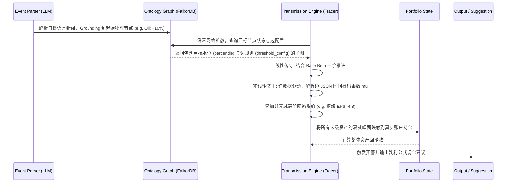

# 基于本体论的 IRM (Investment Risk Management) 核心设计方案

## 1. 设计哲学：从“线性统计”到“拓扑传导”

传统风控侧重于历史波动率（Volatility）和资产间的统计相关性（Correlation matrix）。但当黑天鹅事件发生时，历史相关性往往会失效。
**本体论风控 (Ontological Risk Management)** 的核心假设是：**市场是一个由因果和逻辑链条构成的复杂网络（语义图谱）**。风险并非随机爆发，而是沿着特定的“实体-关系”拓扑结构进行传导的。

---

## 2. 核心架构：三层架构模型

IRM 系统由以下三个逻辑层构成。各层的详细技术规范请参阅对应的子模块设计文档：

1.  **知识图谱层 (Ontology Layer)**: 存储资产、枢纽、事件的物理节点与逻辑连边。
    *   详见：[scripts/ontology/DESIGN.md](./scripts/ontology/DESIGN.md)
2.  **推理计算层 (Inference Engine)**: 基于图算法的风险传导推演与资产风险评分。
    *   详见：[scripts/analyzer/DESIGN.md](./scripts/analyzer/DESIGN.md)
3.  **决策与执行层 (Portfolio & Strategy)**: 基于凯利公式的动态调仓建议。
    *   相关决策逻辑已并入：[scripts/analyzer/DESIGN.md](./scripts/analyzer/DESIGN.md)

---

## 3. 全局交互工作流 (Workflow)



### 3.1 大语言模型 (LLM) 的核心角色定义

在系统中，LLM 不负责直接计算数学风险，而是作为连接非结构化现实碎片与高度结构化图谱之间的**翻译官和映射器 (Semantic Router & Parser)**。

*   **输入端**: 事件解析。将含糊的新闻（如：“沙特设施遇袭”）翻译成图分析引擎能接收的“初始扰动参数 ($\Delta A$)”。
*   **输出端**: 投顾解说。接收计算出的冰冷数字，结合图谱中的 `logic` 属性，为交易员生成逻辑连贯的“诊断报告”。
*   **工程解法**: 让大模型负责语义理解，让 falkordb 和 Python 算法负责定量的数学传导（Neuro-Symbolic AI 神经符号学架构）。

---

## 4. 子模块分布与文档索引

系统采用“文档随模块走”的原则进行组织：

| 模块目录 | 核心职责 | 设计文档 |
| :--- | :--- | :--- |
| **`ontology`** | 知识图谱 Schema 定义、Schema 同步 | [DESIGN.md](./scripts/ontology/DESIGN.md) |
| **`analyzer`** | 传导引擎 (`tracer.py`)、凯利决策、账本管理 | [DESIGN.md](./scripts/analyzer/DESIGN.md) |
| **`polymarket`** | Polymarket 事件胜率抓取与预测源系统 | [DESIGN.md](./scripts/polymarket/DESIGN.md) |
| **`providers`** | 外部数据源适配 (Fred, YFinance, AkShare) | [DESIGN.md](./scripts/providers/DESIGN.md) |

---

## 5. 项目工程结构

```text
irm/
├── scripts/
│   ├── irm.sh             # 统一操作 CLI 入口路由 (irm tracer, irm portfolio, etc.)
│   ├── entrypoint.sh      # 容器启动引导与后台生命周期维持
│   ├── ontology/          # 图谱物理法则与同步器
│   ├── analyzer/          # 算力引擎与持仓建议专家
│   ├── polymarket/        # 预测市场事件解析器 (Polymarket)
│   └── providers/         # 环境感知管道 (股价、分位、盈利同步)
├── Dockerfile
└── docker-compose.yml
```

---

## 6. 系统部署与容器拓扑 (Deployment)

### 6.1 容器集群架构

系统由两个核心容器组成，通过 Docker 内部网络通信。采用 **Host Mode** (`--network host`) 消除 NAT 损耗，确保大规模图查询的毫秒级响应。

1.  **`irm` 算力容器**: 承载所有的业务逻辑与数据管道。包含 OpenBB SDK、图计算引擎 (`tracer.py`)、凯利公式决策器。
2.  **`redis` 存储容器 (FalkorDB + Config Store)**: 
    *   **FalkorDB**: 存储本体图谱（Nodes/Edges）。
    *   **Redis Key-Value**: 存储来源管理配置（`irm:config:sources`）。

### 6.2 部署建议

*   **持久化**: `redis` 容器必须挂载外部卷，防止 FalkorDB 数据丢失。
*   **凭证管理**: 所有 API Key 应通过环境变量注入，严禁硬编码。
*   **构建与启动**: 使用底层 `stack-ctl` 统领。
    ```bash
    ./stack-ctl.sh build irm
    ./stack-ctl.sh up irm
    ```
